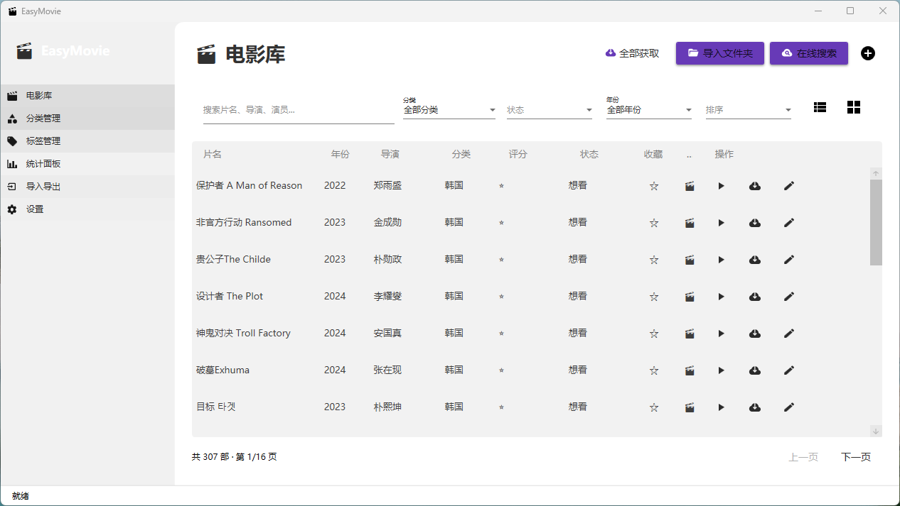

# 🎬 EasyMovie — 轻松管理你的电影库

一款 Windows 桌面电影收藏管理应用，WPF + Material Design + SQLite，简洁易用。


## ✨ 功能特性

- 🎬 **电影库管理** — 表格/卡片双视图，搜索/筛选/排序/分页
- 📁 **分类管理** — 多级分类树，无限嵌套
- 🏷️ **标签系统** — 自定义颜色标签，多对多关联
- ⭐ **评分记录** — 1-10 评分 + 观看状态 + 笔记 + 收藏
- 📊 **统计面板** — 饼图/柱状图/折线图等多种图表
- 📦 **导入导出** — CSV/JSON 导入导出 + 全量备份还原
- 🌐 **多源搜索** — 豆瓣 / TMDB / 1905 / 猫眼，一键获取电影信息
- 📂 **文件夹导入** — 自动扫描本地电影文件并匹配信息
- 🌙 **主题切换** — 浅色/深色/随系统自动切换
- 🔍 **拼音搜索** — 支持中文拼音首字母快速检索

## 🛠️ 技术栈

| 层 | 技术 |
|---|---|
| UI | WPF + MaterialDesignInXamlToolkit |
| MVVM | CommunityToolkit.Mvvm |
| 图表 | LiveCharts2 (SkiaSharp) |
| 数据库 | SQLite + EF Core 9 |
| CSV | CsvHelper |
| 日志 | Serilog |
| 测试 | xUnit + Moq + FluentAssertions |

## 📁 项目结构

```
EasyMovie/
├── EasyMovie.Client/     # WPF 桌面客户端
│   ├── Views/            # 8 个视图
│   ├── Converters/       # 值转换器
│   └── App.xaml          # 主题 & 全局配置
├── EasyMovie.Core/       # 核心业务层
│   ├── Models/           # Movie, Category, Tag
│   ├── Interfaces/       # 服务接口
│   └── Services/         # 业务逻辑
├── EasyMovie.Data/       # 数据访问层
│   ├── Repositories/     # 仓储实现
│   ├── Migrations/       # 数据库迁移
│   └── Configurations/   # Fluent API 配置
├── EasyMovie.Tools/      # 工具 & API
│   ├── ImportExport/     # 导入导出服务
│   └── MovieApi/         # 豆瓣/TMDB/1905/猫眼客户端
└── EasyMovie.Tests/      # 单元测试
```

## 🚀 构建与运行

```bash
# 还原依赖
dotnet restore EasyMovie.sln

# 构建
dotnet build EasyMovie.sln

# 运行
dotnet run --project EasyMovie.Client/EasyMovie.Client.csproj

# 运行测试
dotnet test EasyMovie.Tests/EasyMovie.Tests.csproj
```

### 环境要求

- .NET 10 SDK
- Windows 10/11

## 📸 截图



## 📋 开发进度

| Phase | 内容 | 状态 |
|---|---|---|
| 1 | 项目骨架 + 数据层 | ✅ |
| 2 | 电影库 UI + 搜索筛选 | ✅ |
| 3 | 分类/标签 + 评分收藏 | ✅ |
| 4 | 统计面板多图表 | ✅ |
| 5 | 导入导出 + 备份还原 | ✅ |
| 6 | 多源 API 集成 | ✅ |
| 7 | 主题/设置/日志/打包 | ✅ |
| 8 | 项目重命名 EasyMovie | ✅ |

## 📄 License

MIT License
