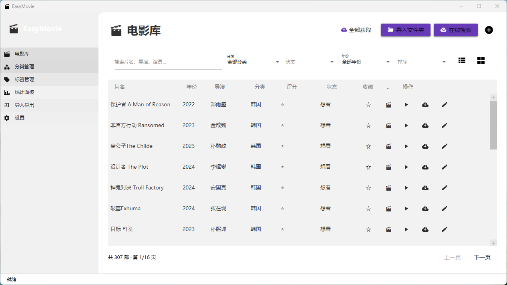

# 🎬 EasyMovie — 轻松管理你的电影库

一款 Windows 桌面电影收藏管理应用，WPF + Material Design + SQLite + VLC 播放内核，简洁易用。

[English](#-easymovie--manage-your-movie-collection-with-ease) | 中文


## 📥 快速下载

> 不想编译？直接下载便携版，解压即用！

| 平台 | 下载 |
|------|------|
| Windows x64 | [](https://github.com/cqdoctor/EasyMovie/releases/latest) |

前往 [Releases](https://github.com/cqdoctor/EasyMovie/releases) 下载 `EasyMovie-win-x64.zip`，解压后运行 `EasyMovie.Client.exe`。

## 🎥 Demo 演示

- 📺 [B站演示视频](https://space.bilibili.com/) — 2 分钟功能概览
- 📺 [YouTube Demo](https://youtube.com/) — Feature walkthrough

## 📸 界面截图

<p align="center">
  
</p>

## ✨ 功能特性

### 🏠 数据概览
- **仪表盘** — 启动首页，展示最近添加/最近观看/收藏电影/热门导演
- **快速导航** — 点击卡片直接跳转电影详情或播放

### 🎬 电影库管理
- **多视图模式** — 表格 / 卡片 / 海报墙 / 合集，四种视图自由切换
- **快速筛选** — 顶部标签一键切换"全部/收藏/想看"，无需展开高级筛选
- **搜索筛选** — 全文搜索 + 高级筛选（分类/年份/评分/状态/收藏/标签 AND/OR 组合）
- **筛选方案复用** — 保存/加载常用筛选组合，载入时自动清洗历史数据（剔除"全部"哨兵、空值归一）
- **拼音搜索** — 支持中文拼音全拼、首字母快速检索
- **批量编辑** — 多选电影 + 批量修改分类/状态/评分/收藏
- **排序分页** — 多字段排序 + 分页浏览（支持首页/末页/跳转）
- **文件缺失提示** — 本地文件不存在时播放按钮禁用，悬浮提示
- **一键收藏** — 列表中直接点击 ★/☆ 切换收藏状态
- **首屏秒开** — 首次加载立即显示第一页，后台异步初始化筛选数据

### 🎥 播放器
- **窗口内嵌播放** — 基于 LibVLCSharp 的主窗口内嵌播放器，不弹独立窗口
- **硬件解码** — 默认 d3d11va 硬件解码（规避 dxva2 解码白块），可回退软解
- **字幕与音轨** — 多字幕/多音轨切换，优先读取媒体轨道信息（不受播放状态影响）
- **倍速播放** — 多档倍速切换
- **全屏 / 迷你模式** — 全屏与迷你窗口播放，退出全屏自动恢复主窗口边框
- **音量与截图** — 音量调节、播放中截图

### 📁 分类与标签
- **分类管理** — 多级分类树，无限嵌套，按国家/地区自动归类
- **标签系统** — 自定义颜色标签，多对多关联
- **统一入口** — 分类与标签在同一页面集中管理
- **自动分类** — 获取信息后自动根据国家分配分类，分类变更时自动更新

### 🎞️ 电影合集
- **合集管理** — 创建/编辑/删除合集，如"漫威宇宙"、"哈利波特系列"
- **海报展示** — 合集内电影以海报墙形式展示，支持播放和详情查看
- **灵活管理** — 添加/移除电影，搜索支持拼音首字母

### ⭐ 评分与记录
- **评分系统** — 1-10 评分 + 观看状态（未看/想看/已看）+ 笔记 + 收藏
- **状态切换** — 列表中点击状态文字即可循环切换：未看 → 想看 → 已看
- **播放即标记** — 点击播放按钮自动标记为"已看"并记录观影日志
- **观影记录** — 电影详情中随时记录/编辑观影日志
- **重复检测** — 自动检测重复电影，一键清理

### 📅 观影日历
- **日历视图** — 按月查看观影记录，直观展示每日观影情况
- **自动记录** — 播放电影或标记已看时自动创建观影日志
- **月份导航** — 前后月份切换，今日高亮显示
- **电影详情** — 日历格子显示电影标题，悬浮显示评分

### 📊 统计面板
- **概览卡片** — 总数/已看/想看/未看/评分/收藏/总观影时长
- **评分分布** — 水平条形图，10分到1分
- **外部评分回填** — 个人评分缺失时自动采用本地缓存的外部评分（豆瓣/TMDB 等），纯本地读取、零网络依赖
- **年度趋势** — 双色条形图（总数+已看），倒序排列
- **月度观影** — 今年每月观影数量
- **导演/演员排行** — Top 10 出现次数排行
- **国家/地区分布** — 电影产地分布
- **片长分布** — 短片/标准/长片区间分布

### 🔗 电影关系网
- **人物关系图** — 可视化展示导演与演员之间的合作关系
- **节点交互** — 点击人物节点高亮关联关系，查看合作电影列表
- **路径查找** — 查找任意两位影人之间的最短合作路径

### 📰 电影资讯
- **热映推荐** — 集成猫眼/TMDB 电影资讯，展示热映电影
- **详情获取** — 点击资讯卡片一键获取电影详情并添加到库中

### 🤖 AI 智能推荐
- **多轮对话** — 基于你的电影库概况（类型分布、导演、标签等）进行个性化推荐
- **多厂商支持** — 内置 DeepSeek / 智谱GLM / 通义千问 / 百度文心 / Moonshot / 豆包 / Ollama 七大模型预设
- **灵活配置** — 设置页填写 API Key / Endpoint / 模型名，支持一键测试连接
- **流式响应** — AI 回复逐字显示，模拟打字效果

### 🔥 观影热力图
- **GitHub 风格** — 53 周 × 7 天绿色格子矩阵，深浅色主题自适应
- **悬停详情** — 鼠标悬停显示日期 + 当天观看的电影列表
- **统计卡片** — 总观影数 / 观影天数 / 单日最多 / 最长连续天数
- **热门排行** — 观影最多日期 TOP 10，附带片单

### 📦 数据管理
- **多格式导入导出** — CSV/JSON 导入导出 + 全量备份还原（设置页直达）
- **文件夹导入** — 自动扫描本地电影文件并匹配信息
- **自动备份** — 可配置每天/每周/每月自动备份数据库
- **备份历史** — 查看备份列表，一键恢复或删除
- **手动备份** — 随时创建备份，打开备份目录

### 🌐 多源搜索
- **多源并发** — 豆瓣 / TMDB / OMDb / 1905 / 猫眼 多源并发获取，主链路 TMDB/1905/OMDb，豆瓣兜底
- **离线缓存优先** — 本地 `cache.db` 缓存命中优先，降低网络依赖与限流影响
- **封面下载** — 自动下载高清海报
- **信息补全** — 标题/导演/演员/年份/国家/简介等一键填充
- **智能搜索** — 自动清理文件名中的编码标记，多关键词多源尝试
- **数据清洗** — 统一在获取入口清洗：过滤 JS 模板变量、无效人名标签与 HTML

### ⌨️ 键盘快捷键
- **可配置** — 设置页自定义快捷键，点击录制，冲突检测
- **持久化** — 自定义快捷键保存到本地，重启不丢失
- **默认快捷键** — Ctrl+F 搜索 / Ctrl+N 添加 / Delete 删除 / F5 刷新 / F3 切换视图 等

### 🎨 界面与体验
- **主题切换** — 浅色/深色/随系统自动切换
- **国际化** — 中文/英文界面切换
- **可折叠导航** — 统计分析、发现两大分组，手风琴展开，默认折叠
- **自定义对话框** — Material Design 风格对话框，替代系统 MessageBox
- **友好错误提示** — 异常按类型归类为中文提示，并指向 `logs/crash.log` 便于排查
- **性能优化** — 页面预加载 + 批量数据库操作 + 海报后台解码/磁盘缓存，避免大 BLOB 入内存

## 🛠️ 技术栈

| 层 | 技术 |
|---|---|
| UI | WPF + MaterialDesignInXamlToolkit 5.x |
| MVVM | CommunityToolkit.Mvvm |
| 播放 | LibVLCSharp.WPF 3.9.3（VLC 内核） |
| 数据库 | SQLite + EF Core 9 |
| CSV | CsvHelper |
| 日志 | Serilog |
| 测试 | xUnit + Moq + FluentAssertions（485+ 用例） |

## 📁 项目结构

```
EasyMovie/
├── EasyMovie.Client/     # WPF 桌面客户端
│   ├── Views/            # 视图（电影库/详情/播放器/分类标签/统计/日历/关系/资讯/AI/热力图/设置）
│   ├── ViewModels/       # 视图模型（CommunityToolkit.Mvvm）
│   ├── Strings/          # 多语言资源（中/英）
│   ├── Converters/       # 值转换器
│   └── App.xaml          # 主题 & 全局配置 & DI 容器
├── EasyMovie.Core/       # 核心业务层（纯逻辑，不依赖 WPF，便于单测）
│   ├── Models/           # Movie, Category, Tag, SavedFilter, MovieFilterValues/State ...
│   ├── Helpers/          # MovieQueryBuilder / TextCleaner / MovieCreditCleaner / SavedFilterMapper
│   ├── Interfaces/       # 服务接口
│   └── Services/         # 业务逻辑
├── EasyMovie.Data/       # 数据访问层
│   ├── Repositories/     # 仓储实现
│   ├── StatisticsService # 统计聚合
│   ├── RatingBackfill    # 外部评分回填（本地 cache.db）
│   ├── MovieBootstrapService / AiLibrarySummaryService
│   └── CollectionService / WatchLogService / TextCleanupMigration
├── EasyMovie.Tools/      # 工具 & API
│   ├── ImportExport/     # 导入导出服务
│   ├── MovieApi/         # 豆瓣/TMDB/OMDb/1905/猫眼客户端 + 本地缓存
│   └── AIChat/           # 大模型接入（DeepSeek/GLM/通义/文心/Moonshot/豆包/Ollama）
├── EasyMovie.Tests/      # 单元测试（xUnit，485+ 用例）
└── MovieListHeadlessTest/# 无 GUI 冒烟宿主：真实实例化 MovieListView 做加载/翻页/切视图回归
```

## 🚀 构建与运行

```bash
# 还原依赖
dotnet restore EasyMovie.sln

# 构建（推荐关闭并行编译避免 csc 崩溃）
dotnet build EasyMovie.Client/EasyMovie.Client.csproj -p:BuildInParallel=false

# 运行
dotnet run --project EasyMovie.Client/EasyMovie.Client.csproj

# 跑测试
dotnet test EasyMovie.Tests/EasyMovie.Tests.csproj
```

### 环境要求

- .NET 10 SDK
- Windows 10/11

## 📋 开发进度

| Phase | 内容 | 状态 |
|---|---|---|
| 1 | 项目骨架 + 数据层 | ✅ |
| 2 | 电影库 UI + 搜索筛选 | ✅ |
| 3 | 分类/标签 + 评分收藏 | ✅ |
| 4 | 统计面板多图表 | ✅ |
| 5 | 导入导出 + 备份还原 | ✅ |
| 6 | 多源 API 集成 | ✅ |
| 7 | 主题/设置/日志/打包 | ✅ |
| 8 | 项目重命名 EasyMovie | ✅ |
| 9 | 国际化（中/英） | ✅ |
| 10 | 高级筛选 + 保存筛选条件 | ✅ |
| 11 | 批量编辑 + 重复检测 | ✅ |
| 12 | 可配置键盘快捷键 | ✅ |
| 13 | 电影合集管理 | ✅ |
| 14 | 观影日历 + 快速筛选 + 简化观看状态 | ✅ |
| 15 | 数据概览仪表盘 + 电影资讯 + 电影关系网 | ✅ |
| 16 | 分页增强（首页/末页/跳转）+ 首屏秒开 | ✅ |
| 17 | 观影热力图 + AI 智能推荐（多厂商大模型） | ✅ |
| 18 | 统计页外部评分回填（本地缓存，零网络依赖） | ✅ |
| 19 | MovieListView 逻辑下沉 Core + 无 GUI 回归宿主 | ✅ |
| 20 | 播放器统一（移除冗余兜底窗口）+ 筛选单一来源 + 死代码清理 | ✅ |

## 📄 License

MIT License

> 💡 如果觉得有用，请给个 Star ⭐ 支持一下！

---

# 🎬 EasyMovie — Manage Your Movie Collection with Ease

A Windows desktop movie collection manager built with WPF + Material Design + SQLite and a VLC playback core. Simple and intuitive.


## 📥 Download

> Don't want to compile? Grab the portable version, unzip and run!

| Platform | Download |
|----------|----------|
| Windows x64 | [](https://github.com/cqdoctor/EasyMovie/releases/latest) |

Go to [Releases](https://github.com/cqdoctor/EasyMovie/releases) and download `EasyMovie-win-x64.zip`, then run `EasyMovie.Client.exe`.

## 🎥 Demo

- 📺 [B站 Demo](https://space.bilibili.com/) — 2-minute feature overview
- 📺 [YouTube Demo](https://youtube.com/) — Feature walkthrough

## 📸 Screenshots

<p align="center">
  
</p>

## ✨ Features

### 🏠 Dashboard
- **Dashboard** — Startup homepage, shows recent additions / recent watches / favorites / popular directors
- **Quick Navigation** — Click cards to jump to movie details or play

### 🎬 Movie Library
- **Multi-View** — Table / Card / Poster Wall / Collections, four view modes
- **Quick Filters** — One-click tabs for All / Favorites / Watchlist at the top
- **Search & Filter** — Full-text search + Advanced filter (Category/Year/Rating/Status/Favorite/Tags AND/OR)
- **Reusable Filter Presets** — Save/load filter combinations; legacy presets are normalized on load (strips the "All" sentinel, normalizes empty values)
- **Pinyin Search** — Quick search by Chinese pinyin full spelling or initials
- **Batch Edit** — Multi-select + batch modify category/status/rating/favorite
- **Sort & Paginate** — Multi-field sorting + paginated browsing (First/Last page + jump)
- **Missing File Alert** — Play button disabled with tooltip when local file is missing
- **One-Click Favorite** — Toggle ★/☆ directly in the list
- **Instant First Page** — First page loads immediately, filter data initializes in background

### 🎥 Player
- **Embedded Playback** — LibVLCSharp-based player embedded in the main window (no separate popup window)
- **Hardware Decoding** — d3d11va hardware decoding by default (avoids the dxva2 white-screen issue), software decoding fallback available
- **Subtitles & Audio Tracks** — Switch between multiple subtitle/audio tracks, read from media track info (not affected by playback state)
- **Playback Speed** — Multiple speed presets
- **Fullscreen / Mini Mode** — Fullscreen and mini-window playback; exiting fullscreen restores the main window chrome
- **Volume & Snapshot** — Volume control and in-playback snapshots

### 📁 Categories & Tags
- **Categories** — Multi-level category tree, unlimited nesting, auto-categorize by country
- **Tags** — Custom color tags with many-to-many association
- **Unified Page** — Categories and tags managed together in one page
- **Auto-Categorize** — Auto-assign category based on country when fetching info

### 🎞️ Movie Collections
- **Collection Management** — Create/Edit/Delete collections, e.g. "Marvel Universe", "Harry Potter Series"
- **Poster Display** — Movies in collection shown as poster wall with play & detail buttons
- **Flexible Management** — Add/Remove movies, search with pinyin support

### ⭐ Ratings & Records
- **Rating System** — 1-10 rating + watch status (Not Watched / Want to Watch / Watched) + notes + favorites
- **Status Toggle** — Click status text in list to cycle: Not Watched → Want to Watch → Watched
- **Play to Mark** — Click play button auto-marks as "Watched" and creates watch log
- **Watch Logs** — Create/edit watch records from the movie detail page
- **Duplicate Detection** — Auto-detect duplicate movies, one-click cleanup

### 📅 Watch Calendar
- **Calendar View** — Browse watch records by month, intuitive daily overview
- **Auto Logging** — Watch logs created automatically when playing or marking as watched
- **Month Navigation** — Navigate between months, today highlighted
- **Movie Details** — Calendar cells show movie titles, hover for ratings

### 📊 Statistics
- **Overview Cards** — Total/Watched/WantToWatch/NotWatched/Rating/Favorites/Total Runtime
- **Rating Distribution** — Horizontal bar chart, 10 to 1
- **External Rating Backfill** — When a personal rating is missing, locally cached external ratings (Douban/TMDB etc.) are used; fully local, zero network
- **Yearly Trend** — Dual-color bar chart (Total + Watched), descending order
- **Monthly Watch** — Watch count per month this year
- **Director/Cast Ranking** — Top 10 by appearance count
- **Country Distribution** — Movie origin distribution
- **Runtime Distribution** — Short/Standard/Long film range distribution

### 🔗 Movie Relations
- **Relation Graph** — Visualize director-actor collaboration relationships
- **Node Interaction** — Click person nodes to highlight connections, view collaboration movie list
- **Path Finding** — Find the shortest collaboration path between any two people

### 📰 Movie News
- **Trending** — Integrated with Maoyan/TMDB for trending movie news
- **One-Click Add** — Click news cards to fetch movie details and add to library

### 🤖 AI Recommendations
- **Multi-Turn Chat** — Personalized recommendations based on your library profile (genres, directors, tags, etc.)
- **Multi-Provider** — Built-in presets for DeepSeek / Zhipu GLM / Qwen / Baidu ERNIE / Moonshot / Doubao / Ollama
- **Flexible Config** — Set API Key / Endpoint / model name in Settings, with one-click connection test
- **Streaming Response** — AI replies stream in token by token, simulating typing

### 🔥 Watch Heatmap
- **GitHub Style** — 53 weeks × 7 days green cell matrix, auto-adapts to light/dark theme
- **Hover Details** — Hover to show date + movies watched that day
- **Stats Cards** — Total watches / watch days / max per day / longest streak
- **Top Days** — Top 10 most active watch dates with movie lists

### 📦 Data Management
- **Multi-Format Import/Export** — CSV/JSON import/export + full backup & restore (from Settings)
- **Folder Import** — Auto-scan local movie files and match info
- **Auto Backup** — Configurable daily/weekly/monthly automatic database backup
- **Backup History** — View backup list, one-click restore or delete
- **Manual Backup** — Create backup anytime, open backup folder

### 🌐 Multi-Source Search
- **Concurrent Sources** — Douban / TMDB / OMDb / 1905 / Maoyan fetched concurrently; TMDB/1905/OMDb as the main chain with Douban as fallback
- **Offline Cache First** — Local `cache.db` hit takes priority, reducing network dependency and rate-limit impact
- **Cover Download** — Auto-download HD posters
- **Info Completion** — Title/Director/Actors/Year/Country/Synopsis auto-fill
- **Smart Search** — Auto-clean encoding tags from filenames, multi-keyword multi-source search
- **Data Cleaning** — Cleaned at a single fetch entry point: strips JS template variables, invalid name labels and HTML

### ⌨️ Keyboard Shortcuts
- **Configurable** — Customize shortcuts in Settings, click-to-record, conflict detection
- **Persistent** — Custom shortcuts saved locally, survive restarts
- **Defaults** — Ctrl+F Search / Ctrl+N Add / Delete Remove / F5 Refresh / F3 Cycle View, etc.

### 🎨 UI & Experience
- **Theme** — Light/Dark/Follow system
- **i18n** — Chinese/English interface switching
- **Collapsible Navigation** — Statistics and Discover groups, accordion-style, collapsed by default
- **Custom Dialogs** — Material Design styled dialogs replacing system MessageBox
- **Friendly Errors** — Exceptions are categorized into localized messages, pointing to `logs/crash.log` for details
- **Performance** — Page pre-loading + batch DB operations + background poster decoding/disk cache, keeping large BLOBs out of memory

## 🛠️ Tech Stack

| Layer | Technology |
|---|---|
| UI | WPF + MaterialDesignInXamlToolkit 5.x |
| MVVM | CommunityToolkit.Mvvm |
| Playback | LibVLCSharp.WPF 3.9.3 (VLC core) |
| Database | SQLite + EF Core 9 |
| CSV | CsvHelper |
| Logging | Serilog |
| Testing | xUnit + Moq + FluentAssertions (485+ cases) |

## 📁 Project Structure

```
EasyMovie/
├── EasyMovie.Client/     # WPF desktop client
│   ├── Views/            # Views (Library/Detail/Player/Categories/Stats/Calendar/Relations/News/AI/Heatmap/Settings)
│   ├── ViewModels/       # View models (CommunityToolkit.Mvvm)
│   ├── Strings/          # i18n resources (zh-CN/en-US)
│   ├── Converters/       # Value converters
│   └── App.xaml          # Theme & global config & DI container
├── EasyMovie.Core/       # Core business layer (pure logic, no WPF dependency, unit-testable)
│   ├── Models/           # Movie, Category, Tag, SavedFilter, MovieFilterValues/State ...
│   ├── Helpers/          # MovieQueryBuilder / TextCleaner / MovieCreditCleaner / SavedFilterMapper
│   ├── Interfaces/       # Service interfaces
│   └── Services/         # Business logic
├── EasyMovie.Data/       # Data access layer
│   ├── Repositories/     # Repository implementations
│   ├── StatisticsService # Statistics aggregation
│   ├── RatingBackfill    # External rating backfill (local cache.db)
│   ├── MovieBootstrapService / AiLibrarySummaryService
│   └── CollectionService / WatchLogService / TextCleanupMigration
├── EasyMovie.Tools/      # Tools & APIs
│   ├── ImportExport/     # Import/export services
│   ├── MovieApi/         # Douban/TMDB/OMDb/1905/Maoyan clients + local cache
│   └── AIChat/           # LLM integration (DeepSeek/GLM/Qwen/ERNIE/Moonshot/Doubao/Ollama)
├── EasyMovie.Tests/      # Unit tests (xUnit, 485+ cases)
└── MovieListHeadlessTest/# Headless smoke host: instantiates MovieListView for load/page/switch regression
```

## 🚀 Build & Run

```bash
# Restore dependencies
dotnet restore EasyMovie.sln

# Build (recommended to disable parallel build to avoid csc crash)
dotnet build EasyMovie.Client/EasyMovie.Client.csproj -p:BuildInParallel=false

# Run
dotnet run --project EasyMovie.Client/EasyMovie.Client.csproj

# Run tests
dotnet test EasyMovie.Tests/EasyMovie.Tests.csproj
```

### Requirements

- .NET 10 SDK
- Windows 10/11

## 📋 Development Progress

| Phase | Content | Status |
|---|---|---|
| 1 | Project skeleton + Data layer | ✅ |
| 2 | Movie library UI + Search & filter | ✅ |
| 3 | Categories/Tags + Rating & favorites | ✅ |
| 4 | Statistics panel with multiple charts | ✅ |
| 5 | Import/Export + Backup & restore | ✅ |
| 6 | Multi-source API integration | ✅ |
| 7 | Theme/Settings/Logging/Packaging | ✅ |
| 8 | Project rename to EasyMovie | ✅ |
| 9 | i18n (Chinese/English) | ✅ |
| 10 | Advanced filter + Save filter presets | ✅ |
| 11 | Batch edit + Duplicate detection | ✅ |
| 12 | Configurable keyboard shortcuts | ✅ |
| 13 | Movie collection management | ✅ |
| 14 | Watch calendar + Quick filters + Simplified watch status | ✅ |
| 15 | Dashboard + Movie news + Movie relation graph | ✅ |
| 16 | Pagination enhancement (First/Last page) + Instant first page | ✅ |
| 17 | Watch heatmap + AI recommendations (multi-provider LLMs) | ✅ |
| 18 | External rating backfill in statistics (local cache, zero network) | ✅ |
| 19 | MovieListView logic moved to Core + headless regression host | ✅ |
| 20 | Unified player (removed redundant fallback window) + single-source filters + dead code cleanup | ✅ |

## 📄 License

MIT License

> 💡 If you find this project useful, please give it a Star ⭐!
